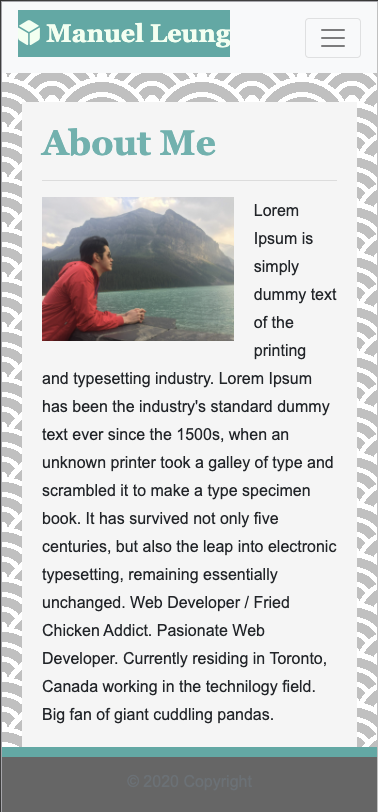

<!--
**manuelleungchen/manuelleungchen** is a ✨ _special_ ✨ repository because its `README.md` (this file) appears on your GitHub profile.

Here are some ideas to get you started:

- 🔭 I’m currently working on ...
- 🌱 I’m currently learning ...
- 👯 I’m looking to collaborate on ...
- 🤔 I’m looking for help with ...
- 💬 Ask me about ...
- 📫 How to reach me: ...
- 😄 Pronouns: ...
- ⚡ Fun fact: ...
-->

<!-- Badges -->
   

# Manuel Leung Chen

## Description
This repository contains my personal **\([Portfolio Website](https://github.com/manuelleungchen/manuelleungchen)\)**. It was buided using the lastest standard HTML, CSS and Bootstrap Framework. This source code is available to everyone under the standard [MIT license](https://github.com/manuelleungchen/manuelleungchen/blob/main/LICENSE). Visit [Manuel Leung Chen Site](https://manuelleungchen.github.io/manuelleungchen/)

## Features
* Meets accessibility standards
* Semantic HTML elements
* Elements follow a logical structure 
* Include a functional and elegant Navegation Bar
* Responsive Layout

## About Me
Web Developer / Fried Chicken Addict.
Pasionate Web Developer. Currently residing in Toronto, Canada 
working in the technilogy field. Big fan of giant cuddling pandas.

- 🔭 Working on IT Support
- 🌱 Currently taking a Coding Bootcamp at University of Toronto
- 🤔 Looking for a position in Web Development 
- 📫 Reach me at: [Email](mailto:manuel.leungchen@gmail.com) and [Linkedin](https://www.linkedin.com/in/manuel-leung-chen/)

## Credits
All changes and improvements were implemented by:

Manuel Leung Chen [GitHub](https://github.com/manuelleungchen)

## Coming Features
* Animation with JavaScript
* Dark Mode capabilities

## License
Copyright \(c\) Microsoft Corporation. All rights reserved.

Licensed under the [MIT license](https://github.com/manuelleungchen/manuelleungchen/blob/main/LICENSE).
